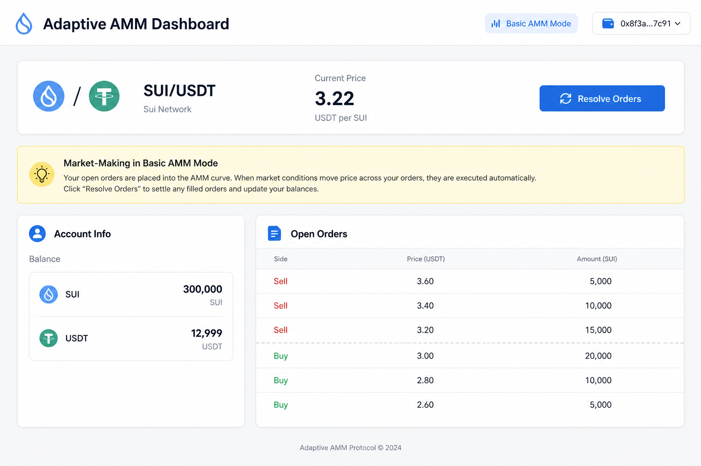
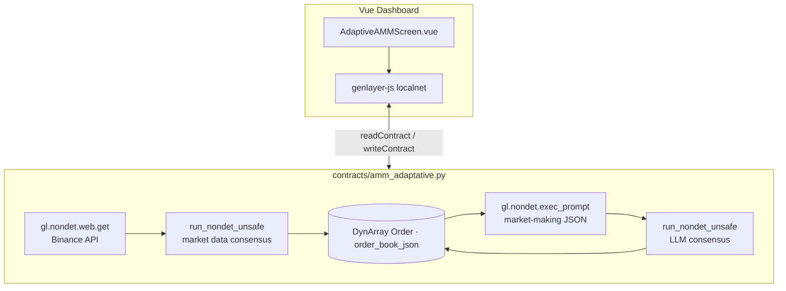

# Adaptive AMM with GenLayer — DeFi Market-Making Prototype

[](https://www.python.org/)
[](https://vuejs.org/)
[](https://docs.genlayer.com/developers)
[](test/)
[](LICENSE)

> Production-quality **GenLayer DeFi prototype**: live order-book ingestion, LLM market-making with validator consensus, on-chain state, and a Vue.js dashboard.

---

## Why this project matters

Most DeFi tutorials stop at price feeds or off-chain bots. This repo shows an **end-to-end Intelligent Contract workflow** aligned with [docs.genlayer.com/developers](https://docs.genlayer.com/developers):

| Capability | What it demonstrates |
|------------|----------------------|
| Live market data on-chain | `gl.nondet.web.get` → Binance public API |
| Validator agreement | `gl.vm.run_nondet_unsafe` with 2% price tolerance |
| LLM-driven strategy | `gl.nondet.exec_prompt(..., response_format="json")` |
| Persistent state | `gl.Contract`, `DynArray[Order]`, typed fields |
| Full-stack dApp | Vue 3 + `genlayer-js@^1.1.8` on `localnet` |
| Local LLM validators | Ollama (`llama3`) — no paid API keys required |

Use it as a **reference implementation** for adaptive market-making, GenLayer storage patterns, and Equivalence Principle design.

---

## Basic AMM vs demo portfolio

This repository focuses on a single, clean architecture. Two concepts are kept separate:

### Basic AMM (live) — active

| Layer | Behavior |
|-------|----------|
| **Market data** | Real-time bids/asks, price, and 24h volume from Binance (`SUIUSDT`) |
| **On-chain fetch** | `refresh_market_data()` via `gl.nondet.web.get` + validator consensus |
| **Strategy** | `resolve()` refreshes live data, then runs LLM market-making |
| **Frontend** | Vue dashboard with live order book panel |

### Demo portfolio (simulated) — active

| Layer | Behavior |
|-------|----------|
| **Balances** | On-chain demo values (e.g. 300k SUI / 12,999 USDT) — not real exchange positions |
| **Open orders** | Seeded on deploy; updated by `resolve()` |
| **Purpose** | Illustrates market-making logic without real funds |

### Advanced Simulated AMM — removed

An earlier **Advanced** mode used CCXT + a separate simulated contract and Vue screen. It was **removed** to reduce complexity and keep one GenLayer-native data path (`gl.nondet.web.get`). The live Basic AMM + demo portfolio covers the same learning goals with less surface area.

---

## Dashboard preview



| UI element | Contract source |
|------------|-----------------|
| Live order book (bids/asks) | `refresh_market_data()` → `get_order_book()` |
| Current price + 24h volume | Binance ticker via `gl.nondet.web.get` |
| Open orders | `get_open_orders()` — persisted on-chain |
| Resolve Orders | `resolve()` = live fetch + LLM consensus + state update |

---

## Architecture



### Write methods

| Method | Description |
|--------|-------------|
| `refresh_market_data()` | Fetches live order book, price, volume; validators agree within 2% tolerance |
| `resolve()` | Calls `refresh_market_data()`, then LLM market-making and updates `open_orders` |

---

## Market-making logic

The contract acts as an **adaptive market maker** for `SUI/USDT`:

1. **Ingest** — Pull depth (`limit=5`) and 24h ticker from Binance (no API key).
2. **Consensus on data** — Leader fetches JSON; validators accept if price is within `MARKET_PRICE_TOLERANCE` (2%).
3. **Snapshot** — Build a market context: live book, price, volume, open orders, demo balances, constraints.
4. **LLM prompt** — Ask for JSON: `cancel_orders`, `new_orders`, `reason_decision`, respecting size limits.
5. **Consensus on strategy** — Leader runs `exec_prompt`; validators compare cancel lists and new-order counts.
6. **Apply** — Cancel by ID, append new orders, store `reason_decision` on-chain.

Constraints enforced in validators and `_is_valid_response`:

- `amount` ≤ `max_order_size`, ≥ `min_order_size`
- `amount` ≤ `max_order_balance_percentage × balance_SUI`
- `cancel_orders` must reference existing order IDs

---

## GenLayer-specific concepts

| Concept | How this repo uses it |
|---------|----------------------|
| **Intelligent Contract** | `AdaptiveAMM(gl.Contract)` with typed storage fields |
| **Depends pin** | `# v0.1.0` + `py-genlayer:…` on line 1–2 of the contract |
| **Equivalence Principle** | `gl.vm.run_nondet_unsafe(leader, validator)` for web data and LLM output |
| **Non-deterministic web** | `gl.nondet.web.get(url)` — validators fetch independently |
| **Non-deterministic LLM** | `gl.nondet.exec_prompt(..., response_format="json")` |
| **Storage** | `DynArray[Order]`, `@allow_storage` dataclass, no storage reads inside nondet blocks |
| **genlayer-js** | `localnet`, `readContract`, `writeContract`, `stateStatus: "accepted"` |
| **Local validators** | Ollama `llama3` via GenLayer Studio — free local inference |

Further reading: [Equivalence Principle](https://docs.genlayer.com/developers/intelligent-contracts/equivalence-principle), [Crafting Prompts](https://docs.genlayer.com/developers/intelligent-contracts/crafting-prompts).

---

## Quick start

> **GenLayer Studio is required.** Tests, deploy, and the Vue app connect to `http://localhost:4000/api`.

### Prerequisites

| Requirement | Version | Notes |
|-------------|---------|-------|
| [Docker](https://docs.docker.com/engine/install/) | 26+ | GenLayer Studio runs in Docker |
| [GenLayer CLI](https://docs.genlayer.com/developers/intelligent-contracts/tooling-setup) | latest | `npm install -g genlayer` |
| Python | 3.10+ | venv + pytest |
| Node.js | 18+ | frontend + GenLayer CLI |

### One-command bootstrap (recommended)

```bash
git clone git@github.com:mpaya5/adaptive-amm-genlayer.git
cd adaptive-amm-genlayer
make dev
```

`make dev` runs setup (if needed), initializes Studio with Ollama on first run, and verifies JSON-RPC.

### Manual setup

```bash
# 1 — Repo dependencies (once)
make setup

# 2 — GenLayer Studio + Ollama (once per machine)
npm install -g genlayer
make studio-init

# 3 — Start Studio (every dev session)
make studio-up
make studio-check
```

**Endpoints**

| Service | URL |
|---------|-----|
| Studio UI | http://localhost:8080 |
| JSON-RPC | http://localhost:4000/api |

LLM validators use **Ollama / llama3** locally (~4.7 GB first pull). No OpenAI credits needed.

---

## Command reference

### Backend & contracts

```bash
make setup                    # venv + pip + .env + npm install
source venv/bin/activate      # required for pytest / eth-account

# Contract lives at:
#   contracts/amm_adaptative.py
```

### GenLayer Studio (Docker via CLI)

```bash
make studio-init              # one-time: Ollama + llama3 + validators
make studio-up                # start Studio every session
make studio-check             # curl eth_chainId on :4000
make studio-down              # stop containers
```

### Tests

```bash
source venv/bin/activate

make test                     # Ollama validator smoke (fast)
make test-deploy              # deploy + demo on-chain state
make test-integration         # Binance live + LLM resolve
make test-all                 # full suite
```

| Test | Studio | Binance network | Ollama |
|------|--------|-----------------|--------|
| `test_ollama_validators_can_be_created` | yes | no | yes |
| `test_deploy_and_demo_state` | yes | no | yes |
| `test_refresh_market_data_live` | yes | yes | yes |
| `test_resolve_with_live_market` | yes | yes | yes |

Optional env vars (defaults: `ollama` / `llama3`):

```bash
export GENLAYER_VALIDATOR_PROVIDER=ollama
export GENLAYER_VALIDATOR_MODEL=llama3
```

### Deploy contract

1. Open http://localhost:8080
2. Paste `contracts/amm_adaptative.py`
3. Deploy with constructor args:

```json
{"symbol": "SUI/USDT", "exchange_symbol": "SUIUSDT", "data_source": "binance"}
```

### Frontend

```bash
cd app
cp .env.example .env          # set VITE_CONTRACT_ADDRESS=<deployed address>
npm run dev                   # or: make frontend-dev
npm run build                 # or: make frontend-build
```

On load, the dashboard calls `refresh_market_data()` to populate the live order book.

### Makefile summary

| Task | Command |
|------|---------|
| Help | `make help` |
| Full bootstrap | `make dev` |
| Setup | `make setup` |
| Studio init (Ollama) | `make studio-init` |
| Start Studio | `make studio-up` |
| Stop Studio | `make studio-down` |
| Verify Studio | `make studio-check` |
| Smoke test | `make test` |
| Deploy test | `make test-deploy` |
| Integration tests | `make test-integration` |
| Frontend dev | `make frontend-dev` |

---

## Troubleshooting

| Symptom | Fix |
|---------|-----|
| `No providers available` | Run `make studio-init` (Ollama only, no paid keys) |
| `Connection refused` on :4000 | Run `make studio-up` |
| Transactions stuck in `ACTIVATED` | `docker restart genlayer-webdriver-1`, wait 15s, retry |
| Slow first start | `llama3` download via Ollama (~4.7 GB) |
| pytest skips Studio tests | Studio not running — `make studio-check` |

---

## GenLayer docs compliance

| Requirement | Status |
|-------------|--------|
| `Depends` py-genlayer pin + runner version | Line 1–2 of contract |
| `from genlayer import *` | Yes |
| `gl.Contract` + typed storage | Yes |
| `@gl.public.view` / `@gl.public.write` | All public methods |
| `DynArray` for on-chain collections | `open_orders`, cancel/new order buffers |
| `@allow_storage` dataclass | `Order` |
| Web connectivity | `gl.nondet.web.get` |
| Equivalence Principle | `gl.vm.run_nondet_unsafe` |
| LLM JSON output | `response_format="json"` |
| No storage access in nondet blocks | Validators use captured locals |
| genlayer-js `localnet` | `app/src/services/genlayer.js` |
| `stateStatus: "accepted"` on reads | `AdaptiveAMM.js` |

---

## Security / Limitations

> **Demo only — not production — no real funds.**

- Demo portfolio balances and open orders are **simulated**, not real exchange positions
- Live order book is **read-only** public market data (Binance)
- LLM output is **non-deterministic**; agreement via Equivalence Principle
- Requires GenLayer Studio with outbound access to Binance
- Never commit `.env` files (see `.gitignore`)
- Rotate any API key that was ever committed to git history

---

## Project layout

```
adaptive-amm-genlayer/
├── contracts/amm_adaptative.py   # Intelligent Contract
├── app/                          # Vue 3 dashboard
├── test/                         # pytest + Studio integration
├── tools/                        # RPC helpers, accounts, transactions
├── scripts/                      # setup, studio-up, dev bootstrap
├── docs/assets/                  # README screenshots
└── Makefile                      # common commands
```

---

## Documentation

- [GenLayer Developers](https://docs.genlayer.com/developers)
- [Your First Contract](https://docs.genlayer.com/developers/intelligent-contracts/your-first-contract)
- [GenLayerJS](https://docs.genlayer.com/developers/decentralized-applications/genlayer-js)
- [Testing](https://docs.genlayer.com/developers/decentralized-applications/testing)

---

## License

MIT — see [LICENSE](LICENSE).
